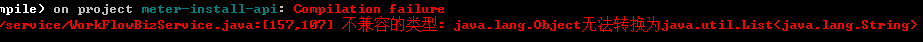

# 不兼容类型

不兼容的类型: `java.lang.Object` 无法转换为 `java.util.List<java.lang.String>`

## 错误详细

### 错误出处

```java
156 List<Map> taskList = processInstanceService.checkValidation(insId + "", userId + "");
157 List<String> taskIds = taskList.stream().map(map -> MapUtils.getString(map, "id")).collect(Collectors.toList());
```

编译报错信息：


### 原因分析

### 错误还原

使用到的 `maven` 依赖

```xml
<dependency>
    <groupId>org.apache.commons</groupId>
    <artifactId>commons-collections4</artifactId>
    <version>4.1</version>
</dependency>
```

还原示例

```java
@Test
public void testGeneric(){
    List<Map> taskList = new ArrayList<>(1);
    taskList.add(Collections.singletonMap("id",1));
    List<String> taskIds = taskList.stream().map(map -> MapUtils.getString(map, "id")).collect(Collectors.toList());
}
```

## 解决方法