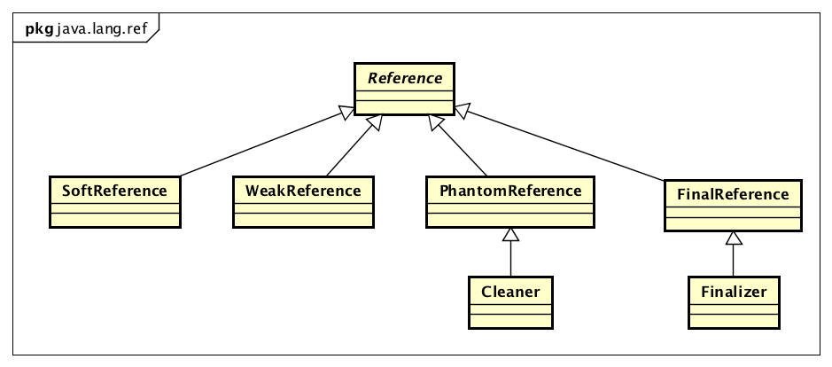

# Reference 源码解读

## Table of Contents

- [Reference 源码解读](#reference-%e6%ba%90%e7%a0%81%e8%a7%a3%e8%af%bb)
  - [Table of Contents](#table-of-contents)
  - [引言](#%e5%bc%95%e8%a8%80)
  - [Reference 是什么](#reference-%e6%98%af%e4%bb%80%e4%b9%88)
  - [Reference 的作用](#reference-%e7%9a%84%e4%bd%9c%e7%94%a8)
  - [Reference 的分类](#reference-%e7%9a%84%e5%88%86%e7%b1%bb)
  - [Reference](#reference)
  - [相关文章资料](#%e7%9b%b8%e5%85%b3%e6%96%87%e7%ab%a0%e8%b5%84%e6%96%99)

## 引言

最近闲下来学习kryo源码时刚好看java的引用相关用法，印象已经模糊，还是重新记录下，主要还是针对`JDK8`而言，文中如有不对请邮件或QQ联系：
QQ： 1310332521
邮箱：1310332521@qq.com

## Reference 是什么

`Reference` 作及物动词时意为“引用”，在JAVA语言中通常用来代表一个对象实例, 又被称作引用变量、变量；最常见的代码 `String msg = new String("Hello World!")`，大致可分为三步：

1. 声明一个叫 `msg` 的引用变量
2. 创建一个内容 `Hello World!` 字符串对象实例
3. 将 `Hello World!` 该字符串对象的内存地址给 `msg` 引用变量

然后就能通过 `msg` 来对该字符串进行各种处理，通俗易懂的说就是对象实例的名称。

## Reference 的作用

一个引用可以代表一个实例对象，而一个对象可以存在多个引用；一个对象存在至少一个引用表明这个对象正在被使用，而JAVA垃圾回收机制根本是看对象是否还存在引用
>Java最初只有普通的强引用，只有对象存在引用，则对象就不会被回收，即使内存不足，也是如此，JVM会爆出OOME，也不会去回收存在引用的对象。
>如果只提供强引用，我们就很难写出“这个对象不是很重要，如果内存不足GC回收掉也是可以的”这种语义的代码。Java在1.2版本中完善了引用体系，提供了4中引用类型：强引用，软引用，弱引用，虚引用。使用这些引用类型，我们不但可以控制垃圾回收器对对象的回收策略，同时还能在对象被回收后得到通知，进行相应的后续操作

1. 可代表一个实例对象
2. 让开发者通过代码决定对象的生命周期，控制 `GC` 对对象的回收策略
3. 处理对象被 `GC` 回收的后续

## Reference 的分类

基类：`java.lang.ref.Reference`
内部实现：

- 强引用(`StrongReference`)： 通常 `Object sr=new SomeObject()` 直接声明并赋值得到就是强引用，只用存在强引用，对象就不会被`GC`
- 软引用(`java.lang.ref.SoftReference`)：比强引用稍弱的引用类型。在内存不足时，垃圾回收器可以直接回收该类引用指向的对象
- 弱引用(`java.lang.ref.WeakReference`): 比软引用还弱的引用类型。垃圾回收器会在`GC`时直接回收此类引用指向的对象
- 虚引用(`java.lang.ref.PhantomReference`)：一种特殊的引用类型。不能通过此类引用获取关联的对象，只能获取对象被回收的通知

`Reference` 整体架构类图

因为默认的引用就是强引用，所以没有强引用的Reference实现类；而`FinalReference`是Java用于实现finalization的一个内部类

## Reference 

## 相关文章资料

[JDK源码阅读-Reference](http://imushan.com/2018/08/19/java/language/JDK%E6%BA%90%E7%A0%81%E9%98%85%E8%AF%BB-Reference/)
[Java篇 - 四种引用(Reference)实战](https://blog.csdn.net/u014294681/article/details/86511451)
[Java对象和引用变量](https://blog.csdn.net/weixin_35813749/article/details/52374749)
