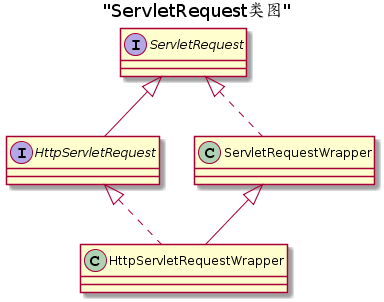

# Servlet

## 简介

---

### Servlet 是什么

>Java Servlet 是运行在 Web 服务器或应用服务器上的程序，它是作为来自 Web 浏览器或其他 HTTP 客户端的请求和 HTTP 服务器上的数据库或应用程序之间的中间层。

#### Servlet 可以做什么

可以收集来自网页表单的用户输入，呈现来自数据库或者其他源的记录，还可以动态创建网页。

#### 特点

能够达到使用CGI（Common Gateway Interface，公共网关接口）的程序同样的效果，并且与之相比还具有的特点：

- 性能明显更好。
- Servlet 在 Web 服务器的地址空间内执行。这样它就没有必要再创建一个单独的进程来处理每个客户端请求。（单进程，多线程）
- Servlet 是独立于平台的，因为它们是用 Java 编写的。
- 服务器上的 Java 安全管理器执行了一系列限制，以保护服务器计算机上的资源。因此，Servlet 是可信的。
- Java 类库的全部功能对 Servlet 来说都是可用的。它可以通过 sockets 和 RMI 机制与 applets、数据库或其他软件进行交互。

### Servlet 架构

servlet 是处于 Web 服务器内的程序，它是一个 **中间层**，作为发送请求端和服务器端的数据库或应用程序之间的中间层

其架构处于：


### Servlet 的作用

Servlet 在服务器上是用来接收和处理并返回数据结果的。

具体的任务包括：

- 读取客户端发送的数据
  - 显式数据：HTML 表单，或者自定义的数据表单
  - 隐式数据：cookies、媒体类型以及压缩格式文件
- 处理数据：访问数据库、调用其他服务等等
- 发送数据到客户端
  - 显式数据：即文档，一般 HTML，还包括文本文件，二进制文件等等
  - 隐式数据：这包括告诉浏览器或其他客户端被返回的文档类型（例如 HTML），设置 cookies 和缓存参数，以及其他类似的任务。

### Servlet 容器

>Servlet Container（Servlet 容器） 是 Web 服务器或者应用服务器的一部分，用于提供基于请求/响应发送模式的网络服务，解码基于 MIME 的请求，并且格式化基于 MIME 的响应。Servlet 容器同时也包含和管理他们的生命周期里 Servlet。

Servlet 容器也叫做 Servlet 引擎；并不等于 WEB 服务器，是 WEB 服务器的一部分。

Servlet 容器的分类：

1. 独立的 Servlet 容器

   基于 Java 技术的 Web 服务器，作为一部分存在。然而大多数 Web 服务器并非基于 Java，于是就有了下面两者。

2. 进程内的 Servlet 容器

   容器由两部分实现，Web 服务器插件和 Java 容器；Web 服务器插件在某个 Web 服务器的 **地址空间内** 打开一个内部 JVM 。

3. 进程外的 Servlet 容器

   也是由两个部分实现的，只是打开的 JVM 是位于 Web 服务器的 **地址空间外**,通常是使用IPC通信（TCP/IP)。

区分的方法也就是根据 Servlet 是否运行在 WEB 服务器上开辟的JVM空间，进程内的使用 JNI 机制，进程外的使用 IPC。

1. Servlet 容器是服务器的哪一部分？

   处理关于 Servlet 的请求\响应，容纳管理所有 Servlet ，是 Web 服务器和 Servlet 交互必不可少的组件。例如 tomcat 集成的 JSP 引擎 和 Servlet 引擎。

## 使用Servlet

---

Servlet 是运行在带 Java Servlet 规范的解释器上的 web 服务器上 的 Java 类。

在编写一个自定义的 Servlet 时，需要按照标准的 Java Servlet 规范进。

### Servlet 生命周期

Servlet 的生命周期规定了如何被加载、实例化、初始化、处理请求，以及何时结束。可以通过 `javax.servlet.Servlet` 接口中的 `init`、`service`和`destroy` 这些 API 表示。JAVA 提供两个默认的 Servlet 接口实现，即`GenericServlet`和`HttpServlet`。

它们之间的区别在于：

- `GenericServlet`只实现了除 `service` 之外的方法
- `HttpServlet`是基于 http 实现的，它实现了 `service` 的同时还提供对应 http 方法的 `doGet`、`doPost`等。

执行顺序：

1. init

    初始化，当 Servlet 被容器加载实例化后对其调用

2. service

    业务处理，当服务器接受到客户端的请求时调用，执行具体业务逻辑。

3. destroy

    终止、销毁，当应用程序结束时调用，执行清理活动。

#### 初始化：init()

servlet 实例不是在服务器启动的时候就初始化，是在客户端请求的时候由 servlet 容器来加载生成实例对象，再调用 `init（）` 方法初始化。当然也可以在`web.xml`中使用`load-on-startup`来配置随服务器启动初始化指定的servlet。

初始化的目的在于方便让 Servlet 能读取持久化的配置，例如一些代价高的资源（JDBC数据库链接），或者执行一次性动作。

初始化方式：

对一个 Servlet 进行初始化都需要重写 `init()` 方法，并且还可以提供一个 **唯一** 的 ServletConfig 对象作为配置，

这个 ServletConfig 配置对象允许 Servlet 访问由 web 应用配置信息提供的键-值对的初始化参数，该配置对象也提供给Servlet 去访问一个 ServletContext 对象，ServletContext 描述了Servlet 的运行时环境。具体参考 "[Servlet 上下文](#1)"。

#### 请求处理： service()

servlet 完成初始化后，servlet 容器就可以使用它处理客户端请求了。

由 ServletRequest 类型的请求对象表示客户端请求，而返回的响应由 ServletResponse 类型的响应对象表示。这两个对象是由容器通过参数传递到 Servlet 接口的 `service` 方法的。

在 HTTP 请求的场景下，容器提供的请求和响应对象具体类型则被 **转化** 为HttpServletRequest 和 HttpServletResponse。具体的业务实现划分到不同的函数，例如`doGet`、`doPost`等。

>需要注意的是，由 servlet 容器初始化的某个 servlet 实例在服务期间，可以在其生命周期中不处理任何请求。

在处理请求时还需要考虑的问题：

- [多线程处理](#多线程处理)
- [异常处理](#异常处理)
- [异步处理](#异步处理)
- [升级处理(HTTP/1.1)](#异步处理)

#### 终止、销毁：destroy()

servlet 容器没必要保持装载的 servlet 持续任何特定的一段时间。一个 servlet 实例可能会在 servlet 容器内保持活跃（active）持续一段时间（以毫秒为单位），servlet容器的寿命可能是几天，几个月，或几年，或者是任何之间的时间。

当 servlet 容器确定 servlet 应该从服务中移除时，将调用 Servlet 接口的 destroy 方法以允许 servlet 释放它使用的任何资源和保存任何持久化的状态。例如，当想要节省内存资源或它被关闭时，容器可以做这个。

**调用条件：**  
在 servlet 容器调用 `destroy` 方法之前，它必须让当前正在执行 `service` 方法的任何线程完成执行，或者超过了服务器定义的时间限制。

一旦调用了 servlet 实例的 destroy 方法，容器无法再路由其他请求到该 servlet 实例了。如果容器需要再次使用该 servlet，它必须用该servlet 类的一个新的实例。在 destroy 方法完成后，servlet 容器必须释放 servlet 实例以便被垃圾回收。

问题：

1. 销毁 servlet 实例后，重新创建 servlet 是否会执行 `init`？

    会。

### 创建 Servlet

使用 `javax.servlet` 和 `javax.servlet.http` 包内定义的 java 类或者接口创建 Servlet

创建方式包括：

1. 实现 Servlet 接口
  
    ```java
    public class ServletDemo implements Servlet{}
    ```
    使用这种方式需要手动实现所有`Servlet`接口定义的方法，包括生命周期方法，但是灵活性更高

2. 继承已定义的 Servlet 类

    Java 提供两个已实现 Servlet 接口的类，`GenericServlet` 和 `HttpServlet`

    在开发网站应用时，我们通常都是直接继承的`HttpServlet`。

    ```java
    public class ServletDemo extends HttpServlet{}
    ```

### 映射到 Servlet

在 web 服务器上进行 servlet 的映射配置，一般有两种方式: 通过注解，通过 web.xml 文件。

- 注解配置

    @WebServlet
    ```java
    @WebServlet("/AnnotationPatternServlet")
    public class AnnotationPatternServlet extends HttpServlet {

        @Override
        protected void doGet(HttpServletRequest req, HttpServletResponse resp) throws ServletException, IOException {
            System.out.println("AnnotationPatternServlet");
        }
    }  
    ```
- web.xml

    通常位于项目`WEB-INF/web.xml`，它是Tomcat目录下的`webapps/ROOT/WEB-INF/web.xml`的副本。
    ```xml
    <?xml version="1.0" encoding="UTF-8"?>
    <web-app xmlns="http://xmlns.jcp.org/xml/ns/javaee"
            xmlns:xsi="http://www.w3.org/2001/XMLSchema-instance"
            **xsi:schemaLocation="http://xmlns.jcp.org/xml/ns/javaee** http://xmlns.jcp.org/xml/ns/javaee/web-app_3_1.xsd"
            version="3.1">

        <servlet>
            <servlet-name>LifeCycleServlet</servlet-name>
            <servlet-class>LifeCycleServlet</servlet-class>
        </servlet>
        <servlet-mapping>
            <servlet-name>LifeCycleServlet</servlet-name>
            <url-pattern>/LifeCycleServlet</url-pattern>
        </servlet-mapping>
    </web-app>
    ```

关于 url 映射规范：

- 以‘/’字符开始、以‘/*’后缀结尾的字符串用于路径匹配。
- 模糊匹配由 `*` 表示，并且尾缀也是一种模糊匹配，例如`*.do`、`*.html`，但是不能同时使用，例如`/test/*.do`
- 以‘*.’开始的字符串用于扩展名映射。
- 空字符串“”是一个特殊的URL模式，其精确映射到应用的上下文根，即，`http://host:port//`请求形式。在这种情况下，路径信息是‘`/`’且servlet路径和上下文路径是空字符串（“”）。
- url-pattern（请求servlet的映射路径）要么以 `/` 开头，要么以`*`开头。例如，只写`test`是非法路径。
- 只包含“/”字符的字符串表示应用的“default”servlet。在这种情况下，servlet路径是请求URL减去上下文路径且路径信息是null。
- 所有其他字符串仅用于精确匹配

多 url 都能匹配时

- 精准匹配优先于模糊匹配，即如果有已经有定义好准确的 url，则不会再查找模糊的 url，例如 `/api/userinfo` 优先于 `/*/userinfo`
- 尾缀模糊有限度最低

映射`/`与`/*`是有区别的

> 它们作用是等价的，但是`/`是 servlet 中预定义好的一个映射路径，它的作用是解析 web 应用的静态资源。
>
> 可以得到结论： **先找动态资源，当动态资源不存在的时候，再找静态资源**

隐式映射:

如果容器有一个内部的JSP容器，.jsp扩展名映射到它，允许执行JSP页面的要求。该映射被称为隐式映射。如果Web应用定义了一个.jsp映射，它的优先级高于隐式映射。

Servlet 容器允许进行其他的隐式映射，只要显示映射的优先。例如，一个 *.shtml 隐式映射可以映射到包含在服务器上的功能。

即，拓展名映射，使用某一中内部容器执行请求，但是当有显式定义该拓展名的 servlet 时，显式优先级更高，则不会调用和拓展名关联的容器。

## 请求

---

### 基本认识

主要内容点：

1. 请求是什么
2. 在java servlet由哪些类型表示
3. 请求的生命周期
4. 请求的内容格式
5. 请求的处理方式

> 请求对象封装了客户端请求的所有信息。在 HTTP 协议中，这些信息是从客户端发送到服务器请求的 HTTP 头部和消息体。

在 Servlet 接口中，请求对象被定为 ServletRequest 接口类型；在 HttpServlet 类中，请求对象被指定为 HttpServletRequest 接口类型，它继承了 ServletRequest 接口，但是 `java.servlet.http` 提供了一个 HttpServletRequest 具体实现 `HttpServletRequestWrapper`

具体关系结构：



```uml
@startuml
Title "ServletRequest类图"

interface ServletRequest
interface HttpServletRequest
class ServletRequestWrapper
class HttpServletRequestWrapper

ServletRequest <|-- HttpServletRequest
ServletRequest <|.. ServletRequestWrapper

ServletRequestWrapper <|-- HttpServletRequestWrapper
HttpServletRequest <|.. HttpServletRequestWrapper
@enduml
```

### 请求的生命周期

通常情况下，每个请求对象只在一个 servlet 的 service 方法的作用域内，或过滤器的 doFilter 方法的作用域内有效，除非该组件启用了异步处理并且调用了请求对象的 [startAsync](#异步处理) 方法。

在发生异步处理的情况下，请求对象一直有效，直到调用 AsyncContext 的 complete 方法。容器通常会重复利用请求对象，以避免创建请求对象而产生的性能开销。开发人员必须注意的是，不建议在上述范围之外保持 startAsync 方法还没有被调用的请求对象的引用，因为这样可能产生不确定的结果。

在升级情况下，如上描述仍成立。

### 请求的内容和格式

思考：

1. 请求由谁发送的，和它有什么关系
2. 请求具体是请求些什么
3. 请求包含了哪些数据，它们分别代表什么，又是如何区分的
4. 请求的数据是哪一部分，它是按照什么格式传输的
5. 又如何获取请求的信息、数据等等
6. 有哪些获取数据的方式，针对不同的内容

一般情况下，我们都是基于 Http 开发网站软件，使用 HttpServletRequest 来封装代表客户端（浏览器）发出的 http 请求，内容格式均按照标准的 http 协议规范定义。

请求消息包括：请求行，请求头，请求数据；

这里只关注 http 请求数据在 servlet 中的处理，详细的 http 规范请参照 [Http 篇](../../http/readme.md)

#### HTTP 请求行

思考：

1. 请求行包括哪些内容，是怎样的格式
2. 请求行的内容和 servlet 哪些 API 关联

http 请求行包括：请求方法，请求路径(URL)，请求协议版本

http 请求可以通过多种方式发送，它们都有各自不同的用途，也是区分资源的一种方式，例如常用的GET、POST，其他方法及用途参考 [Http 篇](../../http/readme.md#Method)

在 Servlet 接口中获取 HTTP方法 的API：

- getMethod()

请求的路径元素：

引导 servlet 服务请求的请求路径由许多重要部分组成。以下元素从请求URI路径得到，并通过请求对象公开：

- Context Path：与 [ServletContext](#ServletContext) 相关联的路径前缀是这个servlet 的一部分。如果这个上下文是基于 Web 服务器的 URL 命名空间基础上的“默认”上下文，那么这个路径将是一个空字符串。否则，如果上下文不是基于服务器的命名空间，那么这个路径以 / 字符开始，但不以 / 字符结束。
  
- Servlet Path：路径部分直接与激活请求的映射对应。这个路径以“/”字符开头，如果请求与“/ *”或“”模式匹配，在这种情况下，它是一个空字符串。
  
- PathInfo：请求路径的一部分，不属于 Context Path 或 Servlet Path。如果没有额外的路径，它要么是null，要么是以'/'开头的字符串。

使用 HttpServletRequest 接口中的下面方法来访问这些信息：

- getContextPath
- getServletPath
- getPathInfo

重要的是要注意，除了请求 URI 和路径部分的 URL 编码差异外，下面的等式永远为真：

    requestURI = contextPath + servletPath + pathInfo

以及查询字符串。

简单的说：

http 请求的 url 在 servlet 中被分为几个部分，这是由于映射的关系，其中还包括模糊匹配。

这几个部分大致的意义为：

- ContextPath：项目在 Servlet 容器中设置的根路径
- ServletPath：具体某一个 Servlet 对象配置的 url 路径
- PathInfo：对某一个 Servlet 采取尾部模糊匹配时，所匹配到的路径

需要注意的是：

请求路径和系统文件路径的转换

在 API 中有两个方便的方法，允许开发者获得与某个特定的路径等价的文件系统路径

- ServletContext.getRealPath(String)
  
    getRealPath 方法需要一个 String 参数，并返回一个 String 形式的路径，这个路径对应一个在本地文件系统上的文件。

- HttpServletRequest.getPathTranslated()

    getPathTranslated方法推断出请求的 pathInfo 的实际路径。

这些方法在 servlet 容器无法确定一个有效的文件路径的情况下，如 Web 应用程序从归档中，在不能访问本地的远程文件系统上，或在一个数据库中执行时，这些方法必须返回 null。

JAR 文件中 `META-INF/resources` 目录下的资源，只有当调用 getRealPath() 方法时才认为容器已经从包含它的 JAR 文件中解压，在这种情况下，必须返回解压缩后位置。 **?**

HTTP 协议可以通过 `getProtocol()` 获取

#### HTTP 请求头

思考：

1. http 请求头有哪些内容，分别有什么作用，是如何存储的，格式
2. 如何获取 http 请求头的内容

通过下面的 HttpServletRequest 接口方法，servlet 可以访问 HTTP 请求的头信息：

- getHeader(String)
- getHeaders(String)
- getHeaderNames()

需要注意的是：

getHeader 方法返回给定头名称的头。多个头可以具有相同的名称，例如HTTP 请求中的 Cache-Control 头。如果多个头的名称相同，getHeader方法返回请求中的第一个头。 getHeaders 方法允许访问所有与特定头名称相关的头值，返回一个 String 对象的 Enumeration（枚举）。

头可包含由 String 形式的 int 或 Date 数据。HttpServletRequest接口提供如下方便的方法访问这些类型的头数据：

- getIntHeader(String)
- getDateHeader(String)

如果 getIntHeader 方法不能转换为 int 的头值，则抛出NumberFormatException 异常。如果 getDateHeader 方法不能把头转换成一个 Date 对象，则抛出 IllegalArgumentException 异常。

#### HTTP 请求参数

思考：

1. http 请求参数是哪一部分，是怎样的格式
2. 使用参数有什么限制，或者在什么情况下有效
3. 可以通过哪些方法或者方式获取到这些数据，它们又有什么区别

当请求是一个 HttpServletRequest 对象，且符合“ **[参数可用时](#参数可用时)** ”描述的条件时，容器从 URI 查询字符串和 POST 数据中填充参数。

GET 方法参数查询字符串一般形式：`http://test/api?name0=value0&key1=value1`。

参数以一系列的名-值对（name-value）的形式保存。任何给定的参数的名称可存在多个参数值。ServletRequest 接口的下列方法可访问这些参数：

- getParameter(String)：返回该键的第一个参数值
- getParameterNames()：返回所有键的集合
- getParameterValues(String)：返回参数名称为该 key 的所有参数值
- getParameterMap()：封装了所有键-值对的映射集合对象

需要注意的是：

- getParameterValues 方法返回一个 String 对象的数组，包含了与参数名称相关的所有参数值。getParameter 方法的返回值必须是getParameterValues 方法返回的 String 对象数组中的第一个值。
- 查询字符串和 POST 请求的数据被汇总到请求参数集合中。查询字符串数据放在 POST 数据之前。例如，如果请求由查询字符串 a=hello 和 POST 数据 a=goodbye&a=world 组成，得到的参数集合顺序将是 a=(hello, goodbye, world)。
- 这些 API 不会暴露 GET 请求（HTTP 1.1所定义的）的路径参数。他们必须从 getRequestURI 方法或 getPathInfo 方法返回的字符串值中解析。

##### 参数可用时

思考：

1. 参数可用指的是什么，又有什么作用
2. 需要满足什么条件才能使参数可用
3. 如果参数不可用，这种情况能怎么做

Post 表单数据能填充到参数集（Paramter Set）前必须满足的条件：

1. 该请求是一个 HTTP 或 HTTPS 请求。
2. HTTP 方法是 POST。
3. 内容类型是 application/x-www-form-urlencoded。
4. 该 servlet 已经对请求对象的任意 getParameter 方法进行了初始调用。

如果不满足这些条件，而且参数集中不包括 post 表单数据，那么 servlet 必须可以通过请求对象的输入流得到 post 数据。如果满足这些条件，那么从请求对象的输入流中直接读取 post 数据将不再有效。

#### HTTP 携带数据（文件）

#### 客户端信息

ServletRequest 保存了用户的信息，可以通过以下方式获取：

- getRemoteAddr(): ip地址
- getRemoteHost(): 主机名
- getRemoteUser(): 认证用户

请求头也保存了许多浏览器的信息，及部分设置

### Cookies

Cookie 是存储在客户端计算机上的文本文件，并保留了各种跟踪信息。

一个 Web 服务器可以分配一个唯一的 session 会话 ID 作为每个 Web 客户端的 cookie，对于客户端的后续请求可以使用接收到的 cookie 来识别。

HttpServletRequest 接口提供了 getCookies 方法来获得请求中的cookie 的一个数组。这些 cookie 是从客户端发送到服务器端的客户端发出的每个请求上的数据。

HttpOnly cookie 暗示客户端它们不会暴露给客户端脚本代码（它没有被过滤掉，除非客户端知道如何查找此属性）。使用 HttpOnly cookie 有助于减少某些类型的跨站点脚本攻击。

Cookies 主要的属性包括：

- 名字，键
- 值
- 加密
- 作用域
- 适用路径
- 有效时间
- 注释

Cookies 常用的API：

- void setDomain(String pattern): 设置适用域
- String getDomain(): 获取适用域
- void setMaxAge(int explry)：设置过期时间，单位秒，默认当前会话持续
- String getName(): 返回名字，不能修改
- void setValue(String val): 设置值
- String getValue()：获取值
- void setPath(): 设置适用路径，默认当前路径及子目录的所有 URL
- String getPath()： 获取适用路径
- void setSecure(boolean flag): 设置加密
- void setComment(String com): 设置注释
- String getComment(): 获取注释

需要注意的是：

请记住，无论是名字还是值，都不应该包含空格或以下任何字符：

    [ ] ( ) = , " / ? @ : ;

### Session

思考：

1. session 是什么，为什么需要它，作用
2. 和 cookies 有什么不同
3. 服务器如何知道客户端和 session 怎样对应的
4. session 的作用域，生命周期
5. session 包含了哪些信息

>Session是服务器端技术，利用这个技术，服务器在运行时可以为每一个用户的浏览器创建一个其独享的Session对象，由于Session为用户浏览器独享，所以用户在访问服务器的Web资源时，可以把各自的数据放在各自的Session中，当用户再去访问服务器中的其它Web资源时，其它Web资源再从用户各自的Session中取出数据为用户服务。

session 即会话，表示一次浏览器和服务器的对话连接。

session 的作用就是保存浏览器和服务器交互的过程的数据信息。通常用来验证保存识别用户信息，以控制权限。用来在无状态的HTTP协议下越过多个请求页面来维持状态和识别用户。

需要注意的是：

一个 session 是一个浏览器独占的，即当通过其他客户端访问服务同一网页时，服务器会给该客户端重新分配一个 session 。

同样 cookies 也是保存信息，它们之间主要的区别包括：

- Cookie是把用户的数据写给用户的浏览器。
- Session技术把用户的数据写到用户独占的session中。
- Session对象由服务器创建，开发人员可以调用request对象的getSession方法得到session对象。

它们之间的关联：

由于 session 是服务器端技术，只有服务器知道客户端和 session 之间的关系也无法维持关系，所以服务器必须通过其他技术告知浏览器”你是谁“，通常是使用 cookies 保存该会话的 sessionid ，以在服务器上找到对应 session。

简单的使用：

当前会话：通过`request.getSession([Boolean isCreate])`得到当前会话对象
设置数据：通过`session.setAttribute(String name,Object key)` 保存属性，会覆盖已有值
获取属性：通过`session.getAttribute(String name)`获取已保存的属性

在 Servlet 中 HttpSession 常用的API：

- String getId()
- void setAttribute(String,Object)
- Object getAttribute(String)
- void removeAttribute(String)
- Enumeration getAttributeNames()
- long getCreationTime()
- boolean isNew():客户端参与该 session 与否
- long getLastAccessedTime()
- int getMaxInactiveInterval():访问最大间隔的保持时间，不大于0永不过期，默认30m
- void setMaxInactiveInterval(int)： 单位秒
- void invalldate():使该 session 无效化

#### 创建会话

Session 在用户第一次访问服务器Servlet，jsp等动态资源就会被自动创建，Session对象保存在内存里。当第一次访问 Servlet 时，如果没有自动创建也可以通过 `req.getSession(true)`来创建。

需要注意的是：

1. 如果访问HTML,IMAGE等静态资源Session不会被创建。
2. Session生成后，只要用户继续访问，服务器就会更新Session的最后访问时间，无论是否对Session进行读写，服务器都会认为Session活跃了一次。
3. 由于会有越来越多的用户访问服务器，因此Session也会越来越多。为了防止内存溢出，服务器会把长时间没有活跃的Session从内存中删除，这个时间也就是Session的超时时间。

>当会话仅是一个未来的且还没有被建立时会话被认为是“新”的。因为 HTTP是一种基于请求-响应的协议，直到客户端“加入”到 HTTP 会话之前它都被认为是新的。当会话跟踪信息返回到服务器指示会话已经建立时客户端加入到会话。直到客户端加入到会话，不能假定下一个来自客户端的请求被识别为同一会话。

如果以下之一是 true，会话被认为是“新”的：

- 客户端还不知道会话
- 客户端选择不加入会话。

与每个会话相关联是一个包含唯一标识符的字符串，也被称为会话ID。会话 ID 的值能通过调用`javax.servlet.http.HttpSession.getId()` 获取，且能在创建后通过调用`javax.servlet.http.HttpServletRequest.changeSessionId()` 改变。

#### 会话的作用域

HttpSession 对象必须被限定在应用（或 servlet 上下文）级别。底层的机制，如使用 cookie 建立会话，不同的上下文可以是相同，但所引用的对象，包括包括该对象中的属性，决不能在容器上下文之间共享。

#### 会话的有效期

每一个会话在创建过后，都有一个超时限制，当超过这个时间该会话就会被容器认定为无效的，在此访问时需要重新创建，而在规定时间内在此访问都会重置计时。

即便用户关闭了浏览器，结束了当前会话，session也不会立即销毁，直到时效内session未被使用。关闭浏览器可能会使已经保存的 sessionid 的cookies失效，导致无法继续之前的会话，可以通过延长 cookies 的有效期来避免。

能使会话无效销毁的只有两种方式：

1. 超时
2. 调用`session.invalldate`

但是也可以设定为永不超时（<=0），超时限制可以通过`session.getMaxInactiveInterval()`获取，而设置这个值有两种方式：

1. 通过调用`setMaxInactiveInterval(int)`
2. 配置`web.xml`，包括项目内的，和Web服务器的都能起作用。

    ```xml
    <session-config>
        <session-timeout>10</session-timeout>
    </session-config>
    ```

#### Session 的用途

已经知道 session 是服务器上保存与用户交互的信息数据的技术，那么它能做到哪些事情呢？

- 验证登录信息
- 阻止表单重复提交，
- 一次性校验码

### 会话跟踪

HTTP 是一种"无状态"协议，这意味着每次客户端检索网页时，客户端打开一个单独的连接到 Web 服务器，服务器会自动不保留之前客户端请求的任何记录。

但是仍然有以下四种方式来维持 Web 客户端和 Web 服务器之间的 session 会话：

- URL 重写
- 隐藏的表单字段
- Cookies
- Session

通过 HTTP cookie 的会话跟踪是最常用的会话跟踪机制，且所有 servlet 容器都应该支持。

容器向客户端发送一个 cookie，客户端后续到服务器的请求都将返回该cookie，明确地将请求与会话关联。会话跟踪 cookie 的标准名字必须是`JSESSIONID`。容器也允许通过容器指定的配置自定义会话跟踪cookie的名字。

URL 重写

会话 ID 必须被编码为 URL 字符串中的一个路径参数。参数的名字必须是jsessionid。下面是一个 URL 包含编码的路径信息的例子：

`http://www.myserver.com/catalog/index.html;jsessionid=1234`

### HTTPS

### 文件上传

### IO

## ServletContext

## Servlet 实现原理

## 参考

1. [Java Servlet 3.1 Specification《Java Servlet 3.1 规范》](https://waylau.gitbooks.io/servlet-3-1-specification/content/docs/The%20Servlet%20Interface/2.3%20Servlet%20Life%20Cycle.html)
