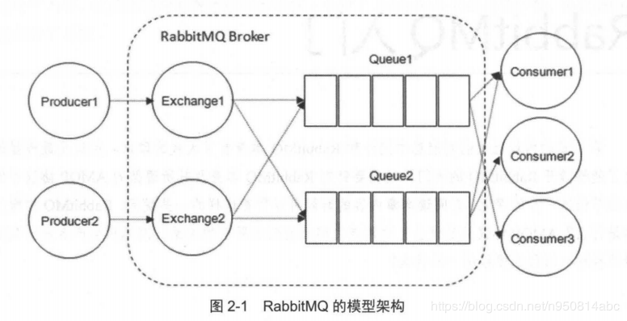
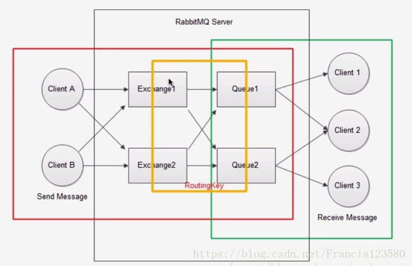
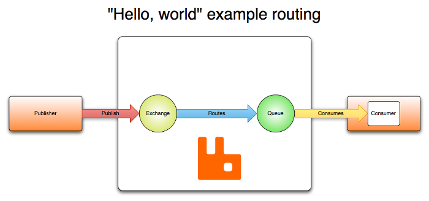

# RabbitMQ 学习笔记

## Table of Contents

## 引言

## 架构模型概念

- `Producer`: 生产者,创建消息并发送到RabbitMQ,消息分为两个部分:标签(Label)、载体(Payload),标签用于描述消息且消费者根据标签获取感兴趣的内容,载体是消息内容即业务逻辑数据
- `Exchange`: 交换器,将接收到的消息分发路由到各个相关的队列中
- `Consumer`: 消费者,连接到RabbitMQ并从队列中获取消息
- `Queue`: 队列, 用于储存生产者的消息,并又消费者获取

---

- `Broker`: 服务节点，大多数情况可以把一台RabbitMQ服务实例看着一个RabbitMQ Broker
- `BindingKey`: 绑定键, 描述 `Exchage` 和 `Queue` 之间关联关系
- `RoutingKey`: 路由键, 表示 `Producer` 创建的消息由指定的 `Exchange` 交给已绑定(通过`BindingKey`关联)的哪些 `Queue`
- `Connection`: 连接, 生产者或消费者和 `Broker` 之间的一条 `TCP` 连接
- `Channel`: 信道, 建立在 `Connection` 上的虚拟连接, 每条AMQP指令都通过信道完成

## 运行模式

- 简单模式
- 工作模式
- 订阅模式
- 路由模式
- 主题模式

### 简单模式

## 消息中间件常见问题

## 参考文章资料

[AMQP 0-9-1 Model Explained(AMQP 0-9-1 模型说明)](https://www.rabbitmq.com/tutorials/amqp-concepts.html)
[AMQP Tutorials - Publish/Subscribe](https://www.rabbitmq.com/tutorials/tutorial-three-python.html)
[RabbitMQ - 模型架构](https://blog.csdn.net/Francis123580/article/details/82560285)
[RabbitMQ实战教程](https://blog.csdn.net/hellozpc/article/details/81436980)
