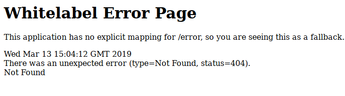

# Whitelabel Error Page 原因及解决方法

标签： springboot, web, error handle

## 什么白页
什么叫Whitelabel Error Page（也叫白页），就是SpringBoot中HTTP请求出现异常的说明页，如下图

## 白页包含的信息

## 白页出现的原因

## 追溯原因并解决

# 参考
[SpringBoot Whitelabel Error Page的根本原因，三种解决方案以及其特点](https://www.jianshu.com/p/b06584591086)